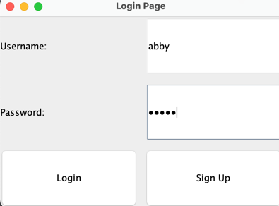
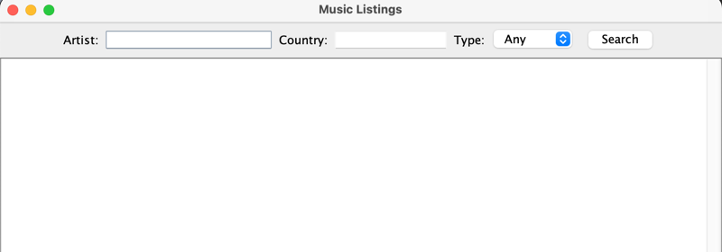
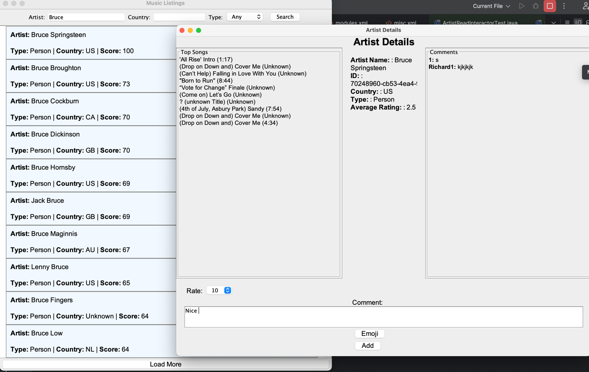
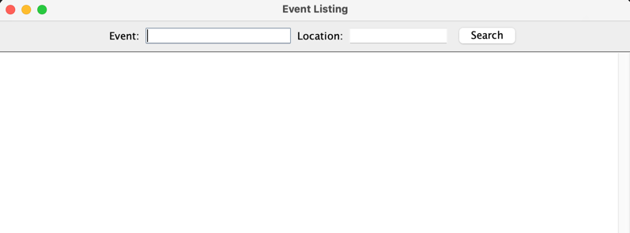

# Music Artist and Event Management System

## Overview

The **Music Artist and Event Management System** is a Java-based software project designed to manage music artist information, events, and user interactions. It incorporates clean architecture, follows SOLID design principles, and integrates real-time data from external APIs. This project provides a robust framework for managing artist-related data and event search while ensuring user-centric functionality.


---

## Table of Contents

1. [Summary of the Project’s Purpose](#summary-of-the-projects-purpose)
2. [Features](#features)
2. [Installation](#installation-instructions)
3. [Usage](#usage)
4. [Architecture](#clean-architecture-implementation)
5. [License](#license)
6. [Feedback and Contributions](#feedback-and-contribution)

---
## Summary of the Project’s Purpose

### What This Project Does
The **Music Artist and Event Explorer** application provides users with an interactive platform to:
- **Create an account** and securely log in.
- **Search for artists** and view their top songs, detailed information, and public ratings.
- **Write and view comments** and rate artists, contributing to an average score that dynamically updates.
- **Search for events**, allowing users to explore music-related happenings.

### Why the Project Was Made
This application was developed to:
- **Simplify music exploration** by combining artist and event search capabilities in one app.
- **Provide a platform for user interaction**, enabling music lovers to share opinions, rate artists, and discover community insights.
- **Apply practical software development concepts**, including clean architecture and user-centric design, as part of the **CSC207 Software Design course.**

### What Problem This Project Solves
The project addresses the need for:
- A **centralized platform** for discovering and interacting with music artists and events.
- An **interactive community-driven system** where users can provide and access real-time feedback about artists.
- **Streamlined event exploration**, making it easy for users to connect with music-related events in their area.

### Accessibility Report
This application is beneficial for:
- **Music enthusiasts** seeking detailed artist insights and community opinions.
- **Casual users** looking for a quick way to explore popular artists and events.
- **Developers and learners** exploring the integration of clean architecture, dynamic data updates, and user interface design principles in a functional app.


## Features

### User Account Management
- **Create Account**: Users can easily create a new account with secure credentials.
- **Login System**: Existing users can log in to access personalized features and interact with the app.

### Artist Search and Exploration
- **Artist Listings**: Search for artists by name and explore their information.
- **Dynamic Song Information**: View a curated list of the artist’s top songs, with details including song titles and length.
- **Rating System**: Users can rate artists on a scale and leave personalized comments.
- **Community Feedback**: View other users' comments and ratings in a dedicated section.
- **Average Rating Updates**: The average score dynamically updates with every new user rating.
- **Persistent Storage**: Comments and ratings entered by users are securely stored in a Firebase database and are displayed on the artist detail page.
 
### Event Search
- **Event Listings**: Search for music-related events .

### Interactive User Interface
- **Responsive Design**: Intuitive navigation through artist and event search functionalities.
- **Engaging Feedback System**: Write comments and rate artists while seamlessly viewing aggregated community responses.
- **Real-Time Updates**: Ratings and comments update dynamically, providing a live experience.


### Additional Features
- **Secure Data Management**: User accounts and interactions are managed securely using modern data storage techniques like Firebase.
- **Error Handling**: The application gracefully handles invalid inputs and provides informative feedback to the user.
- **Cross-Platform Compatibility**: Designed to function on various operating systems, ensuring accessibility for all users.

---

## Installation Instructions

Follow the steps below to install and set up the project on your local machine.

### Prerequisites

Before you begin, ensure you have the following installed on your system:
1. **Java Development Kit (JDK)**: Version 17 or higher is required.
- Download from [Oracle](https://www.oracle.com/java/technologies/javase-downloads.html) or [OpenJDK](https://openjdk.org/).
2. **Maven**: For dependency management and project building.
- Download from [Maven's Official Website](https://maven.apache.org/download.cgi).
3. **Git**: For cloning the repository.
- Download from [Git's Official Website](https://git-scm.com/downloads).
4. **Firebase Admin SDK**: For managing database interactions. Ensure you have access to your Firebase project credentials file (`.json`).
- Follow the [Firebase Admin Setup Guide](https://firebase.google.com/docs/admin/setup) to generate the credentials file.

### Steps to Install and Run

1. **Clone the Repository**
```bash
git clone https://github.com/Richard098789/csc207-Group-Project.git
cd <csc207-Group-Project>
```

2.  **Step 2: Run the Application**

To run the application, execute the main class located at:

```plaintext
src/main/java/app/App.java
```
## Usage

Once the application is installed and running, you can explore its features to interact with the artist and event data. Below is a step-by-step guide on how to use the application:

1. **Sign Up**
    - Navigate to the **Sign-Up** page.
    - Enter a unique username and password to create an account.
    - After successful registration, you will be redirected to the login page.

2. **Log In**
    - Use your credentials to log in to the application.
    - If you do not have an account, click the **Sign-Up** button to create one.

3. **Main Menu**
    - After logging in, you will see options to:
        - **Search for Artists**: View information and interact with artist details.
        - **Search for Events**: Explore events based on the database.

4. **Artist Search**
    - Select the **Artist Listing** option from the main menu.
    - Enter the name of an artist to view their details, including:
        - Top songs (fetched from the MusicBrainz API).
        - A comment section where you can leave feedback and ratings for the artist.
        - Other users' comments and the artist's average rating (stored and updated in the Firebase database).

5. **Event Search**
    - Navigate to the **Event Listings** option.
    - Search for events based on location or artist.
    - View detailed information about the event.

6. **Submit Comments and Ratings**
    - On the artist detail page:
        - Use the **Comments** section to add your thoughts about the artist.
        - Provide a rating for the artist. The average score will update dynamically.
        - All data will be stored in the Firebase database.

7. **Logout**
    - Click the **Logout** button to exit your session safely.

### Example Walkthrough

- **Scenario**: You want to rate "The Beatles."
    - Log in with your account.
    - Select **Artist Listing**.
    - Search for "The Beatles."
    - Add a comment, "Amazing band with timeless music!" and rate them 5 stars.
    - View the average rating and other users' comments.

### Tips
- Ensure you have a stable internet connection for API and Firebase interactions.
- If you encounter issues with search results, verify that the artist/event name is spelled correctly.

This user-friendly design ensures that users can seamlessly navigate and enjoy all features of the application.

## Clean Architecture Implementation

This project follows **Clean Architecture** principles to ensure scalability, maintainability, and testability. Clean Architecture emphasizes separation of concerns by dividing the project into distinct layers, each with its own responsibility.

### Layers of the Project

1. **Entities**
    - Represent the core business logic and data structures.
    - Independent of frameworks and libraries, ensuring reusability and testability.
    - Example: The `User` and `Artist` classes encapsulate core application logic.

2. **Use Cases**
    - Contain the application's business rules.
    - Orchestrate the flow of data between the entities and the interface adapters.
    - Example: Use cases like `LoginInteractor`, `SignupInteractor`, and `ArtistSearchInteractor` handle business logic for their respective features.

3. **Interface Adapters**
    - Adapt the data to and from the use case and the external systems.
    - Include controllers, presenters, and view models.
    - Example: `ArtistSearchController` adapts user input to the search use case, and `ArtistSearchPresenter` prepares the data for display.

4. **Frameworks and Drivers**
    - External systems like databases, APIs, and user interfaces.
    - Example: Firebase integration for storing comments and ratings, and the `MusicBrainzAPI` for fetching artist and event data.

### Key Principles Followed

- **Dependency Inversion:** Higher-level modules (use cases) do not depend on lower-level modules (frameworks); instead, they depend on abstractions like interfaces.
- **Separation of Concerns:** Each layer has a specific purpose, ensuring minimal coupling and high cohesion.
- **Testability:** The architecture allows for mocking dependencies, making it easier to write and maintain unit tests.

By adhering to Clean Architecture principles, this project is designed to handle future enhancements and modifications with minimal disruption.


## License

[](https://opensource.org/licenses/MIT)


Copyright (c) [2024] 

Permission is hereby granted, free of charge, to any person obtaining a copy of this software and associated documentation files (the "Software"), to deal in the Software without restriction, including without limitation the rights to use, copy, modify, merge, publish, distribute, sublicense, and/or sell copies of the Software, and to permit persons to whom the Software is furnished to do so, subject to the following conditions:

The above copyright notice and this permission notice shall be included in all copies or substantial portions of the Software.

THE SOFTWARE IS PROVIDED "AS IS", WITHOUT WARRANTY OF ANY KIND, EXPRESS OR IMPLIED, INCLUDING BUT NOT LIMITED TO THE WARRANTIES OF MERCHANTABILITY, FITNESS FOR A PARTICULAR PURPOSE AND NONINFRINGEMENT. IN NO EVENT SHALL THE AUTHORS OR COPYRIGHT HOLDERS BE LIABLE FOR ANY CLAIM, DAMAGES, OR OTHER LIABILITY, WHETHER IN AN ACTION OF CONTRACT, TORT OR OTHERWISE, ARISING FROM, OUT OF OR IN CONNECTION WITH THE SOFTWARE OR THE USE OR OTHER DEALINGS IN THE SOFTWARE.

##  Feedback and Contribution
This project was developed by the **CSC207 Software Design Team**:
- **Abhigyan**: GUI Development, API usage, documentation.
- **Richard**: Database, API Search, and CLEAN Architecture Design
- **Nick**: Use Case Implementation and architecture Design
- **Chris**: Unit Testing and Documentation

We value your feedback and suggestions for improving this project! If you have any ideas, encountered issues, or want to propose enhancements, please feel free to reach out to us using the following link:

[Provide Feedback Here](https://forms.gle/XdyJD7ujGEXQEQvX7)

Thank you for helping us make this project better!


